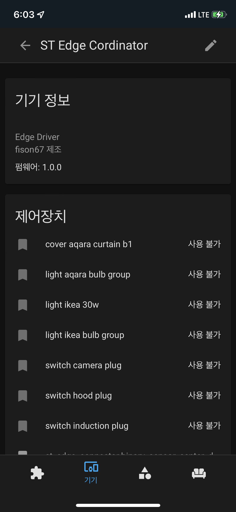
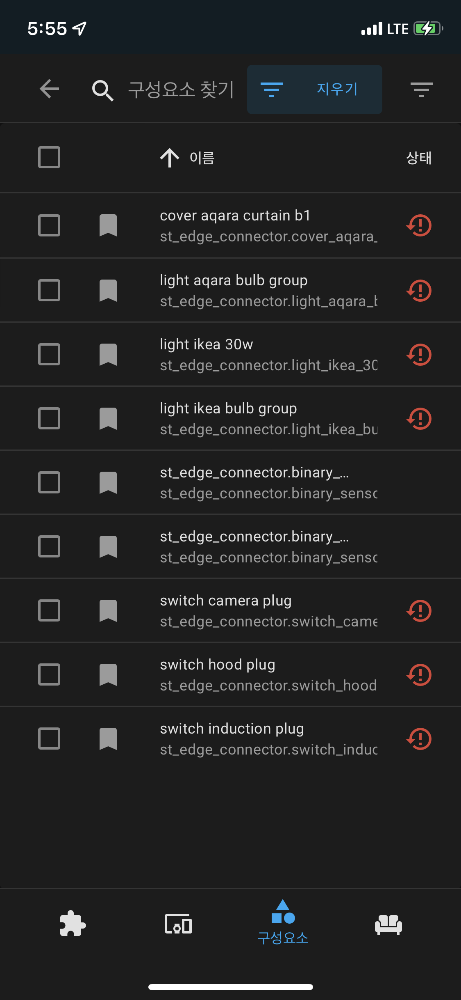
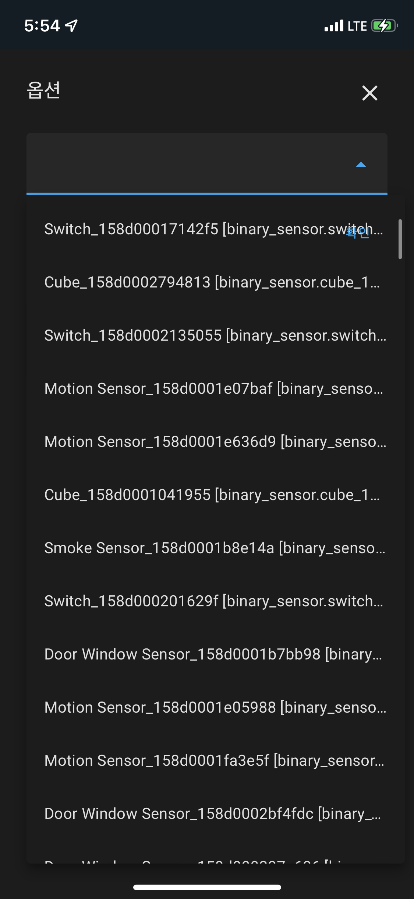
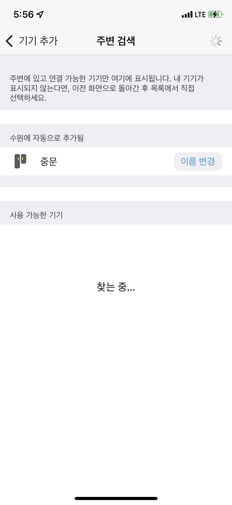
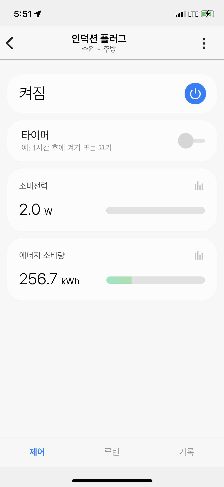
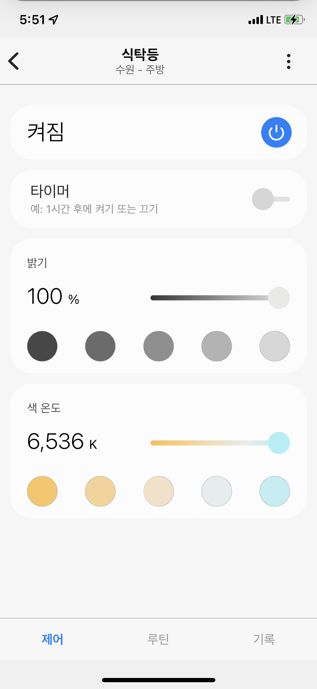
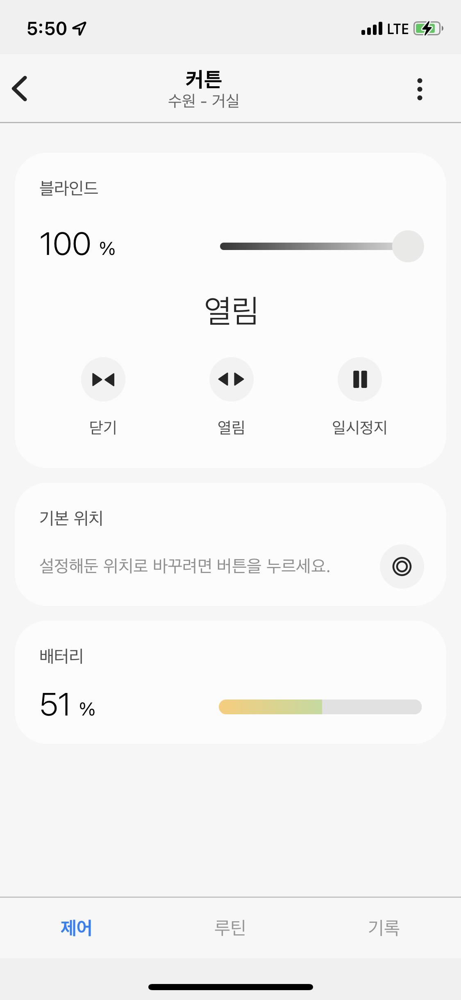
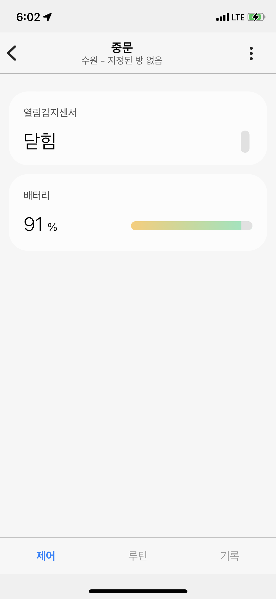

# HA-Edge-Connector

<h3>Homeassistant to Smartthings</h3>
  

## Donation
If this project helps you, you can give me a cup of coffee 

  

## Setup
<b>1. Required</b> 
&nbsp;&nbsp;a. Smartthings Hub & Homeassistant must be in same network. 
&nbsp;&nbsp;b. Multicast function must be enabled on router. 
&nbsp;&nbsp;c. This connector use an udp 30000 port. 
  

<b>2. Install</b> 
&nbsp;&nbsp;a. Copy st_edge_connector folder to /YOUR_HA_PATH/custom_components 
&nbsp;&nbsp;b. Add a ST Edge Connector on integrations  
&nbsp;&nbsp;&nbsp;&nbsp;&nbsp;&nbsp;HUB ADDR: ST HUB Address. 
&nbsp;&nbsp;&nbsp;&nbsp;&nbsp;&nbsp;HA ADDR: HA Address. 
&nbsp;&nbsp;&nbsp;&nbsp;&nbsp;&nbsp;HA PORT: Non used port for TCP 
  
<b>3. ADD</b> 
&nbsp;&nbsp;a. Add a device on st_edge_connector. 
&nbsp;&nbsp;b. Add a device on smartthings app 
  
<b>4. Support devices.</b> 
&nbsp;&nbsp;&nbsp;&nbsp;a. HA Switch 
&nbsp;&nbsp;&nbsp;&nbsp;&nbsp;&nbsp;&nbsp;&nbsp;Without attributes [power, energy] 
&nbsp;&nbsp;&nbsp;&nbsp;&nbsp;&nbsp;&nbsp;&nbsp;switch.samplename 
&nbsp;&nbsp;&nbsp;&nbsp;b. HA Plug 
&nbsp;&nbsp;&nbsp;&nbsp;&nbsp;&nbsp;&nbsp;&nbsp;With attributes [power, energy] 
&nbsp;&nbsp;&nbsp;&nbsp;&nbsp;&nbsp;&nbsp;&nbsp;switch.samplename 
&nbsp;&nbsp;&nbsp;&nbsp;c. HA Light 
&nbsp;&nbsp;&nbsp;&nbsp;&nbsp;&nbsp;&nbsp;&nbsp;With attributes supported_color_modes [color_temp] 
&nbsp;&nbsp;&nbsp;&nbsp;&nbsp;&nbsp;&nbsp;&nbsp;light.samplename 
&nbsp;&nbsp;&nbsp;&nbsp;d. HA White Light 
&nbsp;&nbsp;&nbsp;&nbsp;&nbsp;&nbsp;&nbsp;&nbsp;With attributes supported_color_modes [brigtness] 
&nbsp;&nbsp;&nbsp;&nbsp;&nbsp;&nbsp;&nbsp;&nbsp;light.samplename 
&nbsp;&nbsp;&nbsp;&nbsp;e. HA Cover 
&nbsp;&nbsp;&nbsp;&nbsp;&nbsp;&nbsp;&nbsp;&nbsp;cover.samplename 
&nbsp;&nbsp;&nbsp;&nbsp;f. HA Motion 
&nbsp;&nbsp;&nbsp;&nbsp;&nbsp;&nbsp;&nbsp;&nbsp;With attributes [occupancy, battery] 
&nbsp;&nbsp;&nbsp;&nbsp;&nbsp;&nbsp;&nbsp;&nbsp;binary_sensor.samplename 
&nbsp;&nbsp;&nbsp;&nbsp;g. HA Contact 
&nbsp;&nbsp;&nbsp;&nbsp;&nbsp;&nbsp;&nbsp;&nbsp;With attributes [contact, battery] 
&nbsp;&nbsp;&nbsp;&nbsp;&nbsp;&nbsp;&nbsp;&nbsp;binary_sensor.samplename 
&nbsp;&nbsp;&nbsp;&nbsp;h. HA Presence 
&nbsp;&nbsp;&nbsp;&nbsp;&nbsp;&nbsp;&nbsp;&nbsp;device_tracker.samplename 

  
<b>5. Sample Images.</b> 
 
 
 
 
 <b>Pairing</b> 
 
 <b>Plug</b> 
 
 <b>Light White</b> 
 
 <b>Cover</b> 
 
 <b>Contact</b> 
 
 <b>Motion</b> 
 
